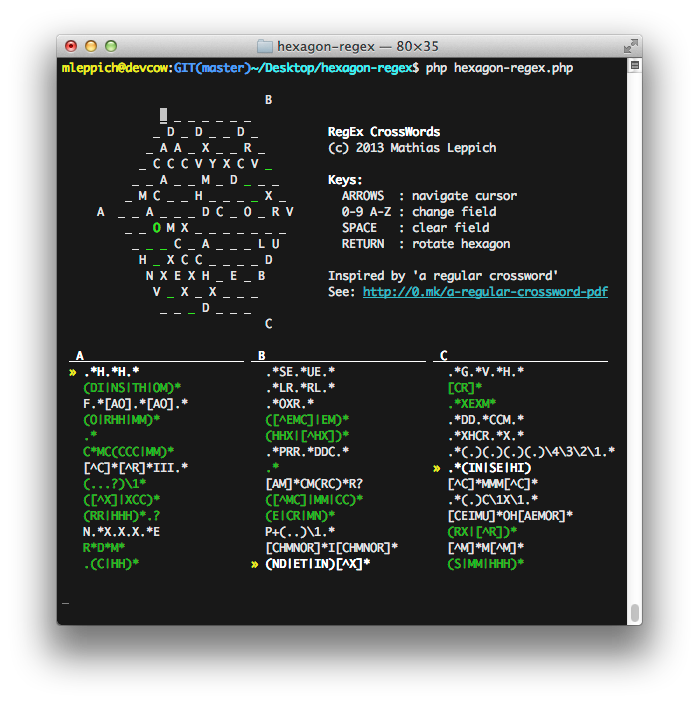

regex-crosswords
================

An interactive command-line version of "a regular crossword". Inspired by "a regular crossword" [PDF](http://www.coinheist.com/rubik/a_regular_crossword/grid.pdf).


How to run?
-----------
```bash
$ php hexagon-regex.php
```

Screenshot
----------
